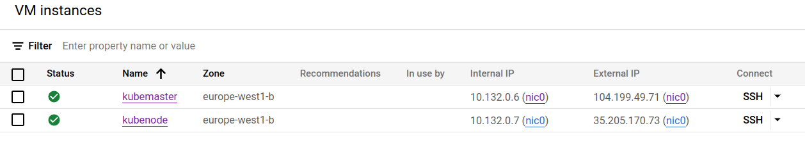
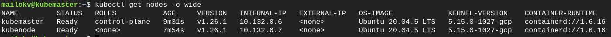
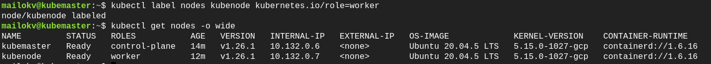

# Setup Kubernetes

First, I launched two virtual machines on GCP with 4 CPUs and 8GB of RAM each named kubemaster and kubenode.
Both virtual machines are in the europe-west1-b zone. Також на обидві віртуальні машини встановлена ubuntu-20.04 x86/64.

Then, according to the instructions, I performed the settings on both virtual machines and ran the necessary commands.
After all the settings, I checked their success with the command:

~~~
kubectl get nodes -o wide
~~~

As you can see from the figure below, both nodes are working correctly.

In order to add a role for kubenode, I decided to add a label using the command:

~~~
kubectl label nodes kubenode kubernetes.io/role=worker
~~~

After executing the command, the worker role appeared in kubenode.

